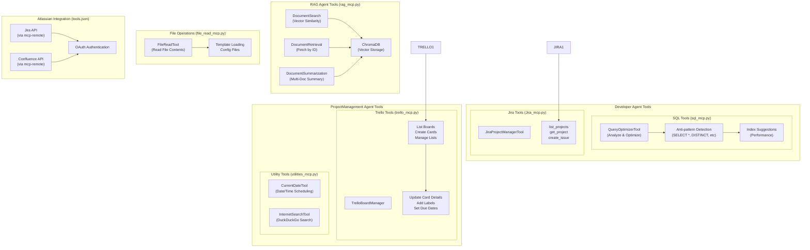
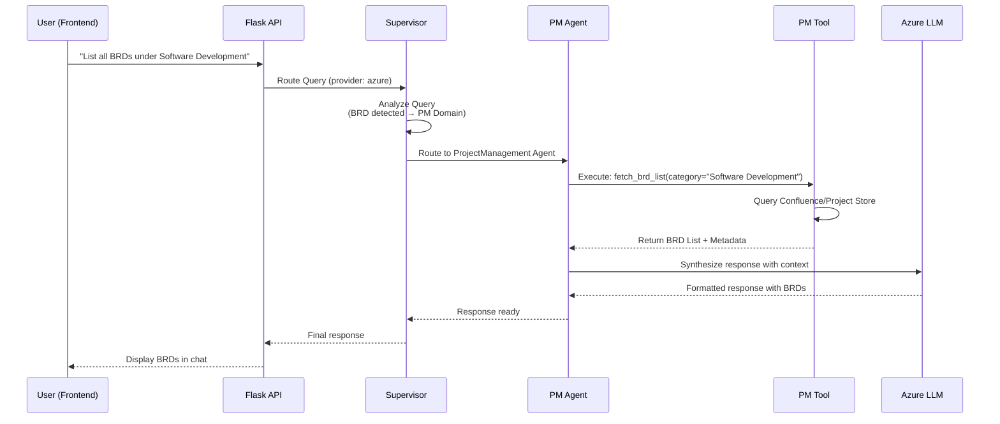
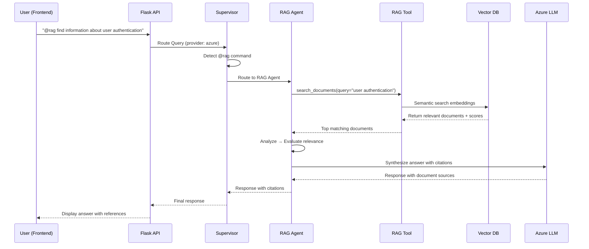

# AIDA Project Architecture

## System Overview

```mermaid
graph TB
    subgraph Frontend["Frontend Layer"]
        HTML["landing.html<br/>(Chat Interface)"]
        UI["Provider/Model Selector<br/>(Azure/Google/Ollama)"]
    end

    subgraph Backend["Backend Layer - Flask"]
        API["Flask API<br/>aida.py"]
        WF["LangGraph Workflow<br/>(supervisor.py)"]
    end

    subgraph Agents["Agent Layer"]
        SUPER["Supervisor Agent<br/>(Routing Logic)"]
        RAG["RAG Agent<br/>(@rag/@doc commands)"]
        DEV["Developer Agent<br/>(Code/SQL/API)"]
        PM["ProjectManagement Agent<br/>(BRD/Sprints/Tasks)"]
    end

    subgraph Tools["Tool Layer"]
        RAG_TOOL["RAG Document Search<br/>(rag_tool.py)"]
        DEV_TOOL["Developer Tools<br/>(developer_tools.py)"]
        PM_TOOL["Project Management Tools<br/>(project_management_tools.py)"]
    end

    subgraph LLM["LLM Providers"]
        AZURE["Azure OpenAI<br/>(gpt-4o-ReCast)"]
        GOOGLE["Google Gemini<br/>(2.5-flash-lite)"]
        OLLAMA["Ollama<br/>(Local Models)"]
    end

    subgraph Storage["Storage & Utilities"]
        VECTORDB["Vector Database<br/>(Embeddings)"]
        LOGGER["Logger<br/>(Logging)"]
        FILE_H["File Handler<br/>(File Operations)"]
    end

    HTML -->|User Query| API
    UI -->|Select Provider/Model| API
    API -->|Initialize Workflow| WF
    WF -->|Route Query| SUPER
    
    SUPER -->|@rag/@doc Query| RAG
    SUPER -->|Code/SQL Query| DEV
    SUPER -->|BRD/PM Query| PM
    SUPER -->|General Chat| PM
    
    RAG -->|Search Docs| RAG_TOOL
    DEV -->|Code/SQL Tools| DEV_TOOL
    PM -->|Project Tools| PM_TOOL
    
    RAG_TOOL -->|Vectorize/Search| VECTORDB
    
    RAG -->|Call LLM| AZURE
    DEV -->|Call LLM| AZURE
    PM -->|Call LLM| AZURE
    
    API -->|Fallback Providers| GOOGLE
    API -->|Fallback Providers| OLLAMA
    
    RAG -->|Log Operations| LOGGER
    DEV -->|Log Operations| LOGGER
    PM -->|Log Operations| LOGGER
    
    WF -->|Response| API
    API -->|Chat Response| HTML
```

## Tools Architecture



## Tools by Agent & Use Case

```mermaid
table
    title Tools Assignment by Agent
    x-axis [RAG Agent, Dev Agent, PM Agent, All Agents]
    y-axis [Tools Count, Capabilities]
    
    data [
        [RAG Agent, 4, "DocumentSearch, DocumentRetrieval, DocumentSummarization, Vector DB"],
        [Dev Agent, 6, "QueryOptimizer, Jira Manager, Code Gen, SQL Optimization, API Design, DB Schema"],
        [PM Agent, 5, "TrelloBoardManager, CurrentDateTool, InternetSearchTool, BRD Management, Sprint Planning"],
        [All Agents, 3, "FileReadTool, LLM Connector, Logger"]
    ]
```

## Tool Usage Examples

### RAG Agent - Document Search
```
User: "@rag find information about authentication in our system"
↓
DocumentSearch(query="authentication system", similarity_threshold=0.7)
↓
ChromaDB returns: [doc_id_1, doc_id_2, doc_id_3] with scores
↓
DocumentSummarization(docs=[doc_1, doc_2, doc_3])
↓
Response: "Based on documents X, Y, Z: ..."
```

### Developer Agent - SQL Optimization
```
User: "optimize this query: SELECT * FROM users WHERE id = 123"
↓
QueryOptimizerTool(query="SELECT * FROM users WHERE id = 123", dialect="postgres")
↓
Detects: [Anti-pattern: SELECT *, No index on id column]
↓
Suggests: [Index on id, Use specific columns]
↓
Optimized: "SELECT id, name, email FROM users WHERE id = 123"
```

### PM Agent - Task Management
```
User: "create a task in Trello for user authentication design"
↓
TrelloBoardManager(action="create_card", 
  title="User Auth Design", 
  list="Development",
  due_date=CurrentDateTool(+7days))
↓
Card created in Trello board
↓
Response: "Task created in Trello with due date 7 days from now"
```

### Multi-Tool Coordination
```
User: "Find docs about API design, optimize the API creation query, and create a Jira ticket"
↓
RAG Agent: DocumentSearch("API design") → Returns API design patterns
↓
Dev Agent: QueryOptimizerTool("API query") → Returns optimized query
↓
Dev Agent: JiraProjectManagerTool("create_issue", title="Implement API", ...)
↓
Response: "Found 3 API design docs, optimized query created, Jira ticket #PROJ-123"
```
- **landing.html**: Single-page chat interface with provider/model selector
- Supports Azure OpenAI, Google Gemini, and Ollama
- Real-time model switching based on provider selection

### **Backend Layer (Flask)**
- **aida.py**: Main Flask application
  - `/api/chat`: Chat endpoint with provider/model selection
  - `/api/settings`: Get current provider/model configuration
  - Default: Azure OpenAI + gpt-4o-ReCast

### **Agent Layer (LangGraph Supervisor Pattern)**
- **Supervisor Agent**: Routes queries intelligently
  - Priority 1: @rag/@doc → RAGAgent
  - Priority 2: Code/SQL → DeveloperAgent
  - Priority 3: BRD/PM → ProjectManagementAgent
  - Priority 4: General → ProjectManagementAgent

- **RAG Agent**: Document search & retrieval (strict workflow)
  - Analyze → Search → Evaluate → Respond
  - Citation format required
  
- **Developer Agent**: Code generation, SQL, API design (flexible)
  - No strict workflow constraints
  
- **ProjectManagement Agent**: BRD, user stories, sprints, tasks (flexible)
  - No strict workflow constraints

### **Tool Layer (MCP Servers)**

#### **RAG Agent Tools** (rag_mcp.py)
- `DocumentSearch`: Semantic search in vector database using embeddings
- `DocumentRetrieval`: Fetch full document content by ID
- `DocumentSummarization`: Summarize multiple documents with key points
- Uses ChromaDB for efficient vector storage and similarity search

#### **Developer Agent Tools** (sql_mcp.py, Jira_mcp.py)
- **SQL Tools**:
  - `QueryOptimizerTool`: Analyze & optimize SQL queries (BigQuery, Snowflake, PostgreSQL, MySQL)
  - Detects anti-patterns, suggests indexes, provides complexity scoring
  - Supports multiple SQL dialects with dialect-specific optimization

- **Code Tools**:
  - Code generation for various languages
  - API design and documentation
  - Database schema design

- **Jira Tools**:
  - `JiraProjectManagerTool`: Manage JIRA projects and issues
  - List projects, create issues, fetch project details
  - Support for issue types: Task, Bug, Story, Epic

#### **Project Management Tools** (trello_mcp.py, utilities_mcp.py)
- **Trello Board Management**:
  - `TrelloBoardManager`: List boards, create cards, manage lists
  - Update card details, add labels, set due dates
  - Organize tasks across multiple boards

- **Utility Tools**:
  - `CurrentDateTool`: Get current date/time for scheduling
  - `InternetSearchTool`: Web search via DuckDuckGo for research

#### **File Operations** (file_read_mcp.py)
- `FileReadTool`: Read file contents for document loading
- Supports templates and configuration file loading

#### **Atlassian Integration** (tools.json)
- Official Atlassian MCP server for Jira & Confluence
- OAuth authentication for secure access
- Requires Node.js v18+

### **LLM Providers**
- **Azure OpenAI** (Default): gpt-4o-ReCast with API version 2025-01-01-preview
- **Google Gemini**: gemini-2.5-flash-lite
- **Ollama**: Local model deployment option

### **Storage & Utilities**
- **Vector Database**: Stores embeddings for RAG document search
- **Logger**: Centralized logging for all operations
- **File Handler**: Manages file operations and document loading
- **LLM Connector**: Abstracts provider-specific LLM calls

---

## Data Flow Example

### Query: "List all BRDs under Software Development"



### Query: "@rag find information about user authentication"



---

## Configuration

**Environment Variables:**
```
AZURE_OPENAI_ENDPOINT=https://your-endpoint.openai.azure.com/
AZURE_OPENAI_API_KEY=your-key
AZURE_OPENAI_DEPLOYMENT_MODEL_NAME=gpt-4o-ReCast
GOOGLE_API_KEY=your-key
OLLAMA_BASE_URL=http://localhost:11434
```

**Default Settings (aida.py):**
```python
current_model_settings = {
    "provider": "azure",
    "model": "gpt-4o-ReCast"
}
```

---

## Complete Tools Reference

| Agent | Tool | MCP File | Functions | Use Cases |
|-------|------|----------|-----------|-----------|
| **RAG Agent** | DocumentSearch | rag_mcp.py | Semantic search in vector DB | Find relevant documents by query |
| | DocumentRetrieval | rag_mcp.py | Fetch full document by ID | Get complete document content |
| | DocumentSummarization | rag_mcp.py | Summarize multiple docs | Extract key points from documents |
| | ChromaDB | rag_mcp.py | Vector storage & similarity | Store embeddings, perform similarity search |
| **Developer Agent** | QueryOptimizerTool | sql_mcp.py | Analyze & optimize SQL queries | Improve SQL performance, detect anti-patterns |
| | SQL Dialect Support | sql_mcp.py | BigQuery, Snowflake, PostgreSQL, MySQL, SQLite, Oracle, T-SQL | Multi-dialect SQL optimization |
| | JiraProjectManagerTool | Jira_mcp.py | list_projects, get_project, create_issue | Manage JIRA projects and issues |
| | Code Generation | (planned) | Generate code in multiple languages | Create boilerplate, implement features |
| | API Design Tool | (planned) | Design REST/GraphQL APIs | Create API specifications |
| | Database Schema Designer | (planned) | Design database schemas | Create table structures, relationships |
| **PM Agent** | TrelloBoardManager | trello_mcp.py | list_boards, create_card, manage_lists | Organize tasks on Trello boards |
| | Trello Card Operations | trello_mcp.py | Update details, add labels, set dates | Manage individual task cards |
| | CurrentDateTool | utilities_mcp.py | Get current date/time | Schedule tasks, set deadlines |
| | InternetSearchTool | utilities_mcp.py | Web search (DuckDuckGo) | Research external information |
| | Atlassian Jira | tools.json | OAuth-authenticated Jira API | Create BRDs, manage project artifacts |
| | Atlassian Confluence | tools.json | OAuth-authenticated Confluence API | Access/create Confluence docs |
| **All Agents** | FileReadTool | file_read_mcp.py | Read file contents | Load templates, config files, documents |
| | LLM Connector | llm_connector.py | get_llm(provider, model) | Call Azure/Google/Ollama LLMs |
| | Logger | logger.py | log_info, log_error, log_debug | Track operations and debug issues |

---

## Tool Dependencies & Environment Variables

### RAG Agent (rag_mcp.py)
```env
# ChromaDB Configuration
CHROMA_HOST=localhost
CHROMA_PORT=8000
CHROMA_COLLECTION_NAME=aida_documents

# Vector Embedding Model
EMBEDDING_MODEL=sentence-transformers/all-MiniLM-L6-v2
```

### Developer Agent (sql_mcp.py, Jira_mcp.py)
```env
# SQL Dialect Support
SQL_DIALECT=postgres  # or bigquery, snowflake, mysql, etc

# Jira Configuration
JIRA_URL=https://your-instance.atlassian.net
JIRA_API_KEY=your-api-key
JIRA_USER_EMAIL=user@example.com
```

### PM Agent (trello_mcp.py)
```env
# Trello Configuration
TRELLO_API_KEY=your-key
TRELLO_API_TOKEN=your-token
TRELLO_BOARD_ID=board-id
DLAI_TRELLO_BASE_URL=https://api.trello.com
```

### Atlassian Integration (tools.json)
```env
# OAuth handled automatically via mcp-remote
# First run opens browser for Atlassian OAuth consent
# Credentials stored securely by mcp-remote
```

### All Agents (file_read_mcp.py, llm_connector.py)
```env
# Azure OpenAI (Default)
AZURE_OPENAI_ENDPOINT=https://your-resource.openai.azure.com/
AZURE_OPENAI_API_KEY=your-key
AZURE_OPENAI_DEPLOYMENT_MODEL_NAME=gpt-4o-ReCast
AZURE_OPENAI_API_VERSION=2025-01-01-preview

# Google Gemini (Fallback)
GOOGLE_API_KEY=your-key

# Ollama (Local Alternative)
OLLAMA_BASE_URL=http://localhost:11434
```

---

## Tool Performance Characteristics

| Tool | Latency | Rate Limit | Dependencies | Fallback |
|------|---------|-----------|--------------|----------|
| DocumentSearch | 200-500ms | None (local) | ChromaDB | N/A |
| DocumentSummarization | 1-3s | None (local) | LLM provider | Manual summary |
| QueryOptimizerTool | 100-300ms | None (local) | SQLGlot, SQLParse | Skip optimization |
| JiraProjectManagerTool | 500-1500ms | 10 req/sec | Jira API | Cache results |
| TrelloBoardManager | 400-1200ms | 10 req/sec | Trello API | Cache results |
| InternetSearchTool | 2-5s | 200 req/day | DuckDuckGo API | Cached search results |
| FileReadTool | 10-100ms | None (local) | File system | N/A |

---

## Key Design Decisions

1. **Supervisor Routing**: Explicit @rag/@doc commands + intelligent analysis prevents wrong agent assignment
2. **RAG-Only Constraints**: Strict workflow (Analyze→Search→Evaluate→Respond) for document queries
3. **Flexible Dev/PM Agents**: No workflow constraints allow natural multi-turn conversations
4. **Multi-Provider Support**: Switch between Azure, Google, Ollama without code changes
5. **Citation Requirements**: RAG outputs always include source documents for traceability
6. **MCP Integration**: Tools expose as MCP servers for standardized agent communication
7. **Dialect Support**: SQL tools support 7+ dialects with dialect-specific optimizations
