# AIDA Architecture - Complete Mermaid Diagrams

## 1. High-Level System Architecture

```mermaid
graph TB
    User["👤 User Input<br/>(Chat Message)"]
    
    subgraph AIDA["AIDA System"]
        Supervisor["🎯 Supervisor Agent<br/>(Routing Logic)"]
        
        subgraph Agents["Specialized Agents"]
            RAG["📚 RAG Agent<br/>(Strict Workflow)"]
            Dev["💻 Developer Agent<br/>(Flexible Workflow)"]
            PM["📋 PM Agent<br/>(Flexible Workflow)"]
        end
        
        subgraph Tools["MCP Tools"]
            RAGTools["📖 RAG Tools<br/>DocumentSearch<br/>DocumentRetrieval<br/>DocumentSummarization"]
            DevTools["🔧 Dev Tools<br/>QueryOptimizer<br/>JiraManager"]
            PMTools["📊 PM Tools<br/>TrelloBoardManager<br/>CurrentDate<br/>InternetSearch"]
        end
        
        LLM["🧠 LLM Provider<br/>(Azure/Google/Ollama)"]
    end
    
    Output["📤 Response to User<br/>(With/Without Citations)"]
    
    User -->|Query| Supervisor
    
    Supervisor -->|@rag/@doc| RAG
    Supervisor -->|Code/SQL| Dev
    Supervisor -->|BRD/Tasks| PM
    Supervisor -->|General| PM
    
    RAG --> RAGTools
    Dev --> DevTools
    PM --> PMTools
    
    RAGTools --> LLM
    DevTools --> LLM
    PMTools --> LLM
    
    RAG --> Output
    Dev --> Output
    PM --> Output
```

## 2. Supervisor Agent - Routing Logic

```mermaid
graph TD
    Query["🔍 User Query Received"]
    
    Check1{"Contains<br/>@rag or @doc?"}
    
    Check1 -->|YES| Route1["✓ Route to RAGAgent<br/>(Confidence: 100%)"]
    Check1 -->|NO| Check2
    
    Check2{"Keyword Analysis<br/>for Domain"}
    
    Check2 -->|Document Keywords<br/>search, research, find| Route2["✓ Route to RAGAgent<br/>(High Confidence)"]
    Check2 -->|Technical Keywords<br/>code, sql, api, debug| Route3["✓ Route to DeveloperAgent<br/>(High Confidence)"]
    Check2 -->|PM Keywords<br/>brd, task, sprint, story| Route4["✓ Route to ProjectManagementAgent<br/>(High Confidence)"]
    Check2 -->|General/Greetings| Route5["✓ Route to ProjectManagementAgent<br/>(Default Handler)"]
    
    Route1 --> Execute["👉 Agent Processes Query"]
    Route2 --> Execute
    Route3 --> Execute
    Route4 --> Execute
    Route5 --> Execute
```

## 3. RAG Agent - Strict 4-Step Workflow

```mermaid
graph TD
    Start["📥 RAG Agent Receives Query"]
    
    Step1["Step 1️⃣: ANALYZE<br/>─────────────<br/>Extract search terms<br/>Understand info need<br/>Prepare search query"]
    
    Step2["Step 2️⃣: SEARCH<br/>─────────────<br/>Call DocumentSearch tool<br/>Query vector database<br/>Retrieve top-k documents"]
    
    Step3["Step 3️⃣: EVALUATE<br/>─────────────<br/>Check relevance<br/>Assess quality<br/>Filter documents"]
    
    Step4["Step 4️⃣: RESPOND<br/>─────────────<br/>Call LLM with docs<br/>Generate answer<br/>Add citations"]
    
    Output["📤 Response with Citations<br/>Example: 'Based on doc_1.pdf<br/>and doc_2.pdf: ...'"]
    
    Start --> Step1
    Step1 --> Step2
    Step2 --> Step3
    Step3 --> Step4
    Step4 --> Output
    
    style Step1 fill:#e1f5ff
    style Step2 fill:#e1f5ff
    style Step3 fill:#e1f5ff
    style Step4 fill:#e1f5ff
```

## 4. Developer Agent - Flexible Workflow

```mermaid
graph TD
    Start["💻 Developer Agent Receives Query"]
    
    Analyze["Analyze Query<br/>─────────<br/>Identify task type<br/>Determine tools needed"]
    
    Decision{"What tools<br/>are needed?"}
    
    Decision -->|SQL Related| SQL["Use QueryOptimizerTool<br/>─────────<br/>Analyze SQL query<br/>Detect anti-patterns<br/>Suggest optimizations"]
    
    Decision -->|Jira/Issues| Jira["Use JiraProjectManagerTool<br/>─────────<br/>Create/update issues<br/>Manage projects<br/>Link artifacts"]
    
    Decision -->|Code Gen| Code["Use Code Generation<br/>─────────<br/>Generate code<br/>Suggest implementations<br/>Provide examples"]
    
    Decision -->|Multiple| Multi["Use Multiple Tools<br/>─────────<br/>Chain tool calls<br/>Integrate results"]
    
    SQL --> LLM["Call LLM<br/>─────────<br/>Synthesize response<br/>Explain results"]
    Jira --> LLM
    Code --> LLM
    Multi --> LLM
    
    LLM --> Output["📤 Response<br/>─────────<br/>No strict citations<br/>Technical explanation"]
    
    Start --> Analyze
    Analyze --> Decision
    
    style SQL fill:#fff3e0
    style Jira fill:#fff3e0
    style Code fill:#fff3e0
    style Multi fill:#fff3e0
```

## 5. Project Management Agent - Flexible Workflow

```mermaid
graph TD
    Start["📋 PM Agent Receives Query"]
    
    Analyze["Analyze Query<br/>─────────<br/>Identify PM need<br/>Determine tools needed"]
    
    Decision{"What PM task?"}
    
    Decision -->|Task/Card| Trello["Use TrelloBoardManager<br/>─────────<br/>Create cards<br/>Manage boards<br/>Organize tasks"]
    
    Decision -->|BRD/Artifacts| Atlassian["Use Atlassian APIs<br/>─────────<br/>Jira: Create BRDs<br/>Confluence: Docs<br/>OAuth authenticated"]
    
    Decision -->|Scheduling| Date["Use CurrentDateTool<br/>─────────<br/>Get current date<br/>Calculate deadlines<br/>Set schedules"]
    
    Decision -->|Research| Search["Use InternetSearchTool<br/>─────────<br/>Search web<br/>Find references<br/>Gather info"]
    
    Trello --> LLM["Call LLM<br/>─────────<br/>Synthesize response<br/>Explain actions"]
    Atlassian --> LLM
    Date --> LLM
    Search --> LLM
    
    LLM --> Output["📤 Response<br/>─────────<br/>Project artifacts<br/>Task assignments"]
    
    Start --> Analyze
    Analyze --> Decision
    
    style Trello fill:#f3e5f5
    style Atlassian fill:#f3e5f5
    style Date fill:#f3e5f5
    style Search fill:#f3e5f5
```

## 6. Tools Architecture - All MCP Servers

```mermaid
graph TB
    subgraph RAGTools["🗂️ RAG Tools (rag_mcp.py)"]
        RAG1["DocumentSearch<br/>─────────────<br/>Input: query string<br/>Output: top-k documents<br/>Latency: 200-500ms"]
        
        RAG2["DocumentRetrieval<br/>─────────────<br/>Input: document ID<br/>Output: full content<br/>Latency: 100-200ms"]
        
        RAG3["DocumentSummarization<br/>─────────────<br/>Input: document list<br/>Output: summary<br/>Latency: 1-3s"]
        
        CHROMA["ChromaDB<br/>Vector Storage<br/>─────────<br/>Stores embeddings<br/>Performs similarity<br/>search"]
        
        RAG1 -.connects to.-> CHROMA
        RAG2 -.connects to.-> CHROMA
        RAG3 -.uses.-> RAG1
    end
    
    subgraph DevTools["🔧 Developer Tools"]
        SQL["QueryOptimizerTool<br/>(sql_mcp.py)<br/>─────────────<br/>Input: SQL query<br/>Dialects: BigQuery,<br/>Snowflake, PostgreSQL,<br/>MySQL, SQLite, Oracle,<br/>T-SQL<br/>Output: Optimized query +<br/>Suggestions<br/>Latency: 100-300ms"]
        
        JIRA["JiraProjectManagerTool<br/>(Jira_mcp.py)<br/>─────────────<br/>Input: project/issue<br/>Operations: list, get,<br/>create<br/>Output: Project data<br/>Latency: 500-1500ms"]
    end
    
    subgraph PMTools["📊 Project Management Tools"]
        TRELLO["TrelloBoardManager<br/>(trello_mcp.py)<br/>─────────────<br/>Input: board/card ops<br/>Operations: create,<br/>update, manage lists<br/>Output: Card data<br/>Latency: 400-1200ms"]
        
        UTIL1["CurrentDateTool<br/>(utilities_mcp.py)<br/>─────────────<br/>Input: none<br/>Output: Current date/time<br/>Latency: 1ms"]
        
        UTIL2["InternetSearchTool<br/>(utilities_mcp.py)<br/>─────────────<br/>Input: query string<br/>Provider: DuckDuckGo<br/>Output: Search results<br/>Latency: 2-5s"]
        
        ATLASSIAN["Atlassian APIs<br/>(tools.json)<br/>─────────────<br/>Jira API: BRDs, issues<br/>Confluence API: docs<br/>Auth: OAuth<br/>Latency: 500-2000ms"]
    end
    
    subgraph SharedTools["🔗 Shared Tools"]
        FILE["FileReadTool<br/>(file_read_mcp.py)<br/>─────────────<br/>Input: file path<br/>Output: file content<br/>Latency: 10-100ms"]
        
        LLM_CONN["LLM Connector<br/>(llm_connector.py)<br/>─────────────<br/>Interfaces with LLM<br/>Handles provider logic<br/>Supports Azure/Google/<br/>Ollama"]
        
        LOGGER["Logger<br/>(logger.py)<br/>─────────────<br/>Logs operations<br/>Tracks agent actions<br/>Debug information"]
    end
    
    style RAGTools fill:#e3f2fd
    style DevTools fill:#fff3e0
    style PMTools fill:#f3e5f5
    style SharedTools fill:#e8f5e9
```

## 7. Complete Data Flow - Query to Response

```mermaid
sequenceDiagram
    participant User as 👤 User
    participant Sup as 🎯 Supervisor
    participant RAG as 📚 RAG Agent
    participant Dev as 💻 Dev Agent
    participant PM as 📋 PM Agent
    participant Tools as 🔧 MCP Tools
    participant LLM as 🧠 LLM Provider
    
    User->>Sup: Send query
    activate Sup
    
    Sup->>Sup: Check for @rag/@doc?
    alt Explicit Command
        Sup->>Sup: Route to RAGAgent (100% confidence)
    else Intelligent Analysis
        Sup->>Sup: Score query against all agents
        Sup->>Sup: Select highest scoring agent
    end
    
    alt Query Type: Document Search
        Sup->>RAG: Route query
        activate RAG
        RAG->>RAG: Step 1: Analyze
        RAG->>Tools: Step 2: DocumentSearch
        activate Tools
        Tools-->>RAG: Return documents
        deactivate Tools
        RAG->>RAG: Step 3: Evaluate
        RAG->>LLM: Step 4: Generate response
        activate LLM
        LLM-->>RAG: Response text
        deactivate LLM
        RAG-->>User: Response + Citations
        deactivate RAG
        
    else Query Type: Code/SQL
        Sup->>Dev: Route query
        activate Dev
        Dev->>Dev: Analyze task
        Dev->>Tools: Call appropriate tool
        activate Tools
        Tools-->>Dev: Tool result
        deactivate Tools
        Dev->>LLM: Synthesize response
        activate LLM
        LLM-->>Dev: Response text
        deactivate LLM
        Dev-->>User: Technical response
        deactivate Dev
        
    else Query Type: BRD/Task
        Sup->>PM: Route query
        activate PM
        PM->>PM: Analyze task
        PM->>Tools: Call appropriate tool
        activate Tools
        Tools-->>PM: Tool result
        deactivate Tools
        PM->>LLM: Synthesize response
        activate LLM
        LLM-->>PM: Response text
        deactivate LLM
        PM-->>User: Project response
        deactivate PM
    end
    
    deactivate Sup
```

## 8. Routing Decision Matrix

```mermaid
graph TB
    Query["📥 Input Query"]
    
    Query --> CheckCommand{"Explicit Command?"}
    
    CheckCommand -->|@rag or @doc| RagDirect["RAGAgent<br/>Confidence: 100%<br/>Priority: 1"]
    
    CheckCommand -->|No Command| KeywordScore["Keyword Scoring<br/>─────────────<br/>Match against all agents<br/>Calculate scores"]
    
    KeywordScore --> ScoreCalc["Score = <br/>(keyword_matches /<br/>total_keywords) *<br/>priority_weight"]
    
    ScoreCalc --> Compare["Compare all agent scores"]
    
    Compare --> Decision{"Select Best<br/>Agent"}
    
    Decision -->|Document Focused| RagScore["RAGAgent<br/>Score: Highest<br/>Confidence: 85-95%"]
    
    Decision -->|Code Focused| DevScore["DeveloperAgent<br/>Score: Highest<br/>Confidence: 80-90%"]
    
    Decision -->|PM Focused| PMScore["ProjectManagementAgent<br/>Score: Highest<br/>Confidence: 75-85%"]
    
    Decision -->|No Clear Match| PMDefault["ProjectManagementAgent<br/>(Default Handler)<br/>Confidence: 70%"]
    
    RagDirect --> Execute["Execute Selected Agent"]
    RagScore --> Execute
    DevScore --> Execute
    PMScore --> Execute
    PMDefault --> Execute
```

## 9. Example Workflows

### Workflow A: Document Search with @rag Command

```mermaid
graph TD
    Start["User: '@rag find info<br/>about authentication'"]
    
    Start -->|Supervisor| Check["✓ @rag detected<br/>100% confidence<br/>→ RAGAgent"]
    
    Check -->|Step 1| A1["ANALYZE<br/>Extract: 'authentication'"]
    
    A1 -->|Step 2| A2["SEARCH<br/>DocumentSearch in<br/>ChromaDB<br/>Return: [doc1, doc2, doc3]"]
    
    A2 -->|Step 3| A3["EVALUATE<br/>Check relevance<br/>All 3 documents<br/>high quality"]
    
    A3 -->|Step 4| A4["RESPOND<br/>Call LLM with<br/>documents + query"]
    
    A4 --> Output["📤 Based on doc1.pdf,<br/>doc2.pdf, doc3.pdf:<br/>Authentication is...<br/><br/>✓ Citations included"]
```

### Workflow B: SQL Optimization

```mermaid
graph TD
    Start["User: 'optimize<br/>SELECT * FROM users'"]
    
    Start -->|Supervisor| Check["Keyword match: sql<br/>→ DeveloperAgent<br/>Confidence: 90%"]
    
    Check -->|Analyze| Dev["Identify task:<br/>SQL optimization"]
    
    Dev -->|Select Tool| Tool["Use QueryOptimizer<br/>Dialect: postgres"]
    
    Tool -->|Execute| Result["Results:<br/>✗ Anti-pattern: SELECT *<br/>✗ No index on id<br/>✓ Suggest specific cols<br/>✓ Add index"]
    
    Result -->|LLM| Output["📤 Optimized:<br/>SELECT id, name, email<br/>FROM users<br/>WHERE id = 123<br/>(no strict format)"]
```

### Workflow C: Task Creation for BRD

```mermaid
graph TD
    Start["User: 'list all BRDs<br/>under Software Dev'"]
    
    Start -->|Supervisor| Check["Keywords: brd, software<br/>→ ProjectManagementAgent<br/>Confidence: 95%"]
    
    Check -->|Analyze| PM["Identify task:<br/>BRD retrieval"]
    
    PM -->|Select Tool| Tool["Use Atlassian APIs<br/>(Jira/Confluence)"]
    
    Tool -->|Execute| Result["Results:<br/>BRD_001: Auth System<br/>BRD_002: API Design<br/>BRD_003: Database"]
    
    Result -->|LLM| Output["📤 Response:<br/>Found 3 BRDs:<br/>1. Auth System<br/>2. API Design<br/>3. Database<br/>(no strict format)"]
```

## 10. Configuration & LLM Providers

```mermaid
graph TB
    Config["🔧 Model Settings<br/>─────────────<br/>provider: 'azure'<br/>model: 'gpt-4o-ReCast'"]
    
    Config --> Route["Passed to Supervisor<br/>and all Agents"]
    
    Route --> LLMSelector{"Select LLM<br/>Provider"}
    
    LLMSelector -->|Azure| Azure["🟦 Azure OpenAI<br/>─────────────<br/>Model: gpt-4o-ReCast<br/>API Version:<br/>2025-01-01-preview<br/>Endpoint: https://...<br/>Status: PRIMARY"]
    
    LLMSelector -->|Google| Google["🟨 Google Gemini<br/>─────────────<br/>Model:<br/>gemini-2.5-flash-lite<br/>API: Google Cloud<br/>Status: FALLBACK"]
    
    LLMSelector -->|Ollama| Ollama["🟩 Ollama Local<br/>─────────────<br/>Models: Any local<br/>URL: localhost:11434<br/>Status: LOCAL OPTION"]
    
    Azure --> All["Used by all agents<br/>for LLM calls"]
    Google --> All
    Ollama --> All
    
    All --> Output["Generate responses<br/>in natural language"]
```

## 11. Agent Comparison Matrix

```mermaid
graph TB
    Table["<b>Agent Comparison</b><br/>"]
    
    RAGRow["<b>RAG Agent</b><br/>━━━━━━━━━━━<br/>Workflow: STRICT (4 steps)<br/>Tools: 3 (Search, Retrieve, Summarize)<br/>Output Format: STRICT (with citations)<br/>Use Case: Document retrieval<br/>Confidence: 90-100%"]
    
    DevRow["<b>Developer Agent</b><br/>━━━━━━━━━━━<br/>Workflow: FLEXIBLE<br/>Tools: 2+ (SQL, Jira)<br/>Output Format: FLEXIBLE<br/>Use Case: Code, SQL, API<br/>Confidence: 80-95%"]
    
    PMRow["<b>PM Agent</b><br/>━━━━━━━━━━━<br/>Workflow: FLEXIBLE<br/>Tools: 4+ (Trello, Jira, etc)<br/>Output Format: FLEXIBLE<br/>Use Case: BRD, tasks, planning<br/>Confidence: 75-95%"]
    
    style RAGRow fill:#e3f2fd
    style DevRow fill:#fff3e0
    style PMRow fill:#f3e5f5
```

## 12. Key Routing Keywords

```mermaid
graph TB
    subgraph RAGKeywords["📚 RAG Keywords<br/>(→ RAGAgent)"]
        RK1["@rag, @doc<br/>(explicit)"]
        RK2["search, research<br/>find, look up"]
        RK3["summarize<br/>extract, retrieve"]
        RK4["knowledge base<br/>documents"]
    end
    
    subgraph DevKeywords["💻 Developer Keywords<br/>(→ DeveloperAgent)"]
        DK1["code, implement<br/>write, generate"]
        DK2["sql, query<br/>optimize, database"]
        DK3["api, endpoint<br/>schema, design"]
        DK4["bug, debug<br/>fix, review"]
    end
    
    subgraph PMKeywords["📋 PM Keywords<br/>(→ ProjectManagementAgent)"]
        PK1["brd, prd<br/>requirements"]
        PK2["user story<br/>sprint, backlog"]
        PK3["task, jira<br/>trello, card"]
        PK4["plan, schedule<br/>deadline, status"]
    end
    
    style RAGKeywords fill:#e3f2fd
    style DevKeywords fill:#fff3e0
    style PMKeywords fill:#f3e5f5
```

## 13. Complete System Architecture - All Components

```mermaid
graph TB
    subgraph Input["📥 INPUT LAYER"]
        User["User Query<br/>from Frontend<br/>(landing.html)"]
    end
    
    subgraph Control["🎯 CONTROL LAYER"]
        Super["Supervisor Agent<br/>─────────────<br/>Route Query<br/>Check Commands<br/>Keyword Analysis"]
    end
    
    subgraph Execution["⚙️ EXECUTION LAYER"]
        RAGAgent["📚 RAGAgent<br/>─────────────<br/>Strict Workflow<br/>Analyze→Search<br/>→Evaluate→Respond"]
        
        DevAgent["💻 DeveloperAgent<br/>─────────────<br/>Flexible Workflow<br/>Analyze→Tools<br/>→Synthesize"]
        
        PMAgent["📋 PMAgent<br/>─────────────<br/>Flexible Workflow<br/>Analyze→Tools<br/>→Synthesize"]
    end
    
    subgraph Integration["🔧 INTEGRATION LAYER"]
        RAGTools["RAG Tools<br/>DocumentSearch<br/>DocumentRetrieval<br/>DocumentSummarization"]
        
        DevTools["Dev Tools<br/>QueryOptimizer<br/>JiraManager"]
        
        PMTools["PM Tools<br/>TrelloBoardManager<br/>CurrentDateTool<br/>InternetSearchTool<br/>Atlassian APIs"]
        
        Shared["Shared<br/>FileReadTool<br/>LLMConnector<br/>Logger"]
    end
    
    subgraph External["🌐 EXTERNAL SERVICES"]
        ChromaDB["ChromaDB<br/>Vector DB"]
        
        LLM["LLM Providers<br/>Azure/Google<br/>Ollama"]
        
        APIs["External APIs<br/>Jira, Confluence<br/>Trello, DuckDuckGo"]
    end
    
    subgraph Output["📤 OUTPUT LAYER"]
        Response["User Response<br/>─────────────<br/>RAG: With Citations<br/>Dev: Technical<br/>PM: Project Artifact"]
    end
    
    User --> Super
    
    Super --> RAGAgent
    Super --> DevAgent
    Super --> PMAgent
    
    RAGAgent --> RAGTools
    DevAgent --> DevTools
    PMAgent --> PMTools
    
    RAGTools --> ChromaDB
    RAGTools --> LLM
    
    DevTools --> LLM
    DevTools --> APIs
    
    PMTools --> LLM
    PMTools --> APIs
    
    Shared -.-> RAGTools
    Shared -.-> DevTools
    Shared -.-> PMTools
    
    RAGAgent --> Response
    DevAgent --> Response
    PMAgent --> Response
    
    Response -.-> User
```

